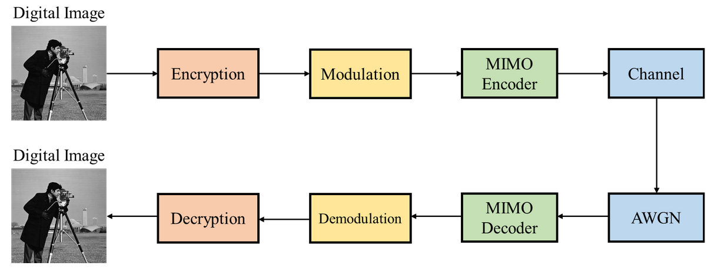
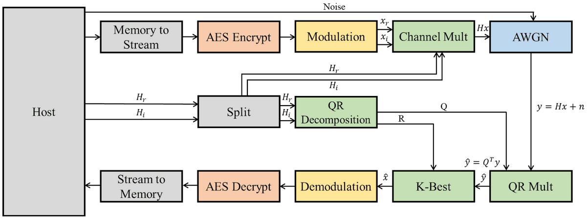

# Wireless Communication System with Encryption

### Final Project Group 5

## Table of Content

- Wireless Communication System with Encryption
  - About The Project
  - OPENCL Flow Directory structure
  - Vitis_HLS Flow Directory structure
  - Results
  - [Usage](#Usage)

## About The Project

Implementation a end-to-end Wireless Communication System with Encryption with HLS

## OPENCL Flow Directory structure
* **OPENCL_0619_v3/PATTERN/**
  * Test Image Pattern
* **OPENCL_0619_v3/MIMO_AES_kernels/src**
  * HLS C++ kernel source code
* **OPENCL_0619_v3/MIMO_AES/src**
  * HLS Host Program

## Vitis_HLS Flow Directory structure
* **AES_CHANNEL_KBEST_ver5/PATTERN/**
  * Test Image Pattern
* **AES_CHANNEL_KBEST_ver5/src**
  * HLS C++ kernel source code & Host Program
## Usage 
* **System Diagram**

* **Host Program Architecture**

  
* **Build the Vitis_HLS Project with Vitis_HLS**
  * `make run CSIM=1 CSYNTH=1 COSIM=1`
* **Running on U50**
  * Use Vitis OPENCL flow
  * Add the src & host program into the project, then build and run.

## Results

**With AES**

**Without AES**

## References

* https://github.com/WilliamsCeng/02Hero
* [AES加密算法的详细介绍与实现_TimeShatter的博客-CSDN博客_aes](https://blog.csdn.net/qq_28205153/article/details/55798628)
* [NetPBM Viewer (kylepaulsen.com)](https://www.kylepaulsen.com/stuff/NetpbmViewer/)
* [Vitis_Libraries/quantitative_finance/L1/tests/normalRNG at master · Xilinx/Vitis_Libraries (github.com)](https://github.com/Xilinx/Vitis_Libraries/tree/master/quantitative_finance/L1/tests/normalRNG)
