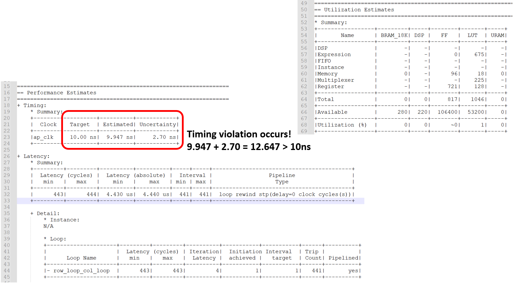

# Video System

## Brief Description of Function

###### System

System includes:

 - Main function: function calls.
   	- PixelIni: Generate pixel_in to be operated.
      	- video_filter_rescale: Rescale pixel_in according to the format of video.
      	- PrintPixel: Print the results of each function.
 - Kernel
   	- filter: Do the multiply accumulate(MAC) on 3$\times$3 window and 3$\times$3 h, which is element-wise multiplication not matrix multiplication.
       - video_2dfilter: prepare window for filter. In this lab, how to prepare the window is the main task.

Host will transfer pixel_in to kernel and transfer out the computing results, pixel_out, from kernel.


###### video_2dfilter

- Simply access 3$\times$3 pixels from pixel_in and store to window.
- Use pipeline for all operations on the window, including memory access and element-wise multiplication with kernel h. The nested for loop of element-wise multiplication has been unrolled by ```#pragma pipeline```. 
  - The timing report is shown below:
  - 
  - The utilization is shown below:
  - 
  - The nested for loop of element-wise multiplication has been unrolled by ```#pragma pipeline```, which make the usage of FFs quite a lot. Because of the 9 pixels needing to be accessed for one kernel operation, the II cannot achieve 1.
  - I add the rewind to the pipeline, the timing and utilization report becomes:
  - 
  - For timing report, the interval of top function has decreased to 10800. The top function has prepared for accessing the new input after only 10800 cycles comparing with the top function without rewind needing 10878 cycles. The bobble has been removed. The usage of FF and LUT has been decreased, which indicates that keeping the bobble needs more resources.
  - Then I add enable_flush to the pipeline with rewind. The report becomes:
  - 
  - The usage of FF and LUT decreases a lot. It indicates that stalling pipeline causes more usage. The II has increased, which is not as my expected. Then I look up the information of flushing the pipeline. I realize that when the pipeline will shut down all the pipeline stage, complete all the computation in the pipeline stage and access next input after finishing all the computing. If the next input has come and the pipeline is in flush state, the pipeline will not access the coming input.
  - After some adjustments of pipeline, I find that the bottleneck of preventing II to achieve 1 is memory access. I move on to the next algorithm provided by the book.

###### video_2dfilter_linebuffer

- In each iteration, only access one pixel from pixel_in.
- Use line buffer to store pixel_in.
- Line buffer is a smaller and faster memory.
- Both line buffer and window do the spatial shift to achieve data reuse.
- The spatial shift is shown below:
- 
- Although the function behavior is not the same as the above, it only access one pixel every element-wise multiplication on window. According to the book, the usage of line buffer is a common way to increase data reuse in video processing. Since most video processing algorithms need to compute with the neighbor pixels. Observing the behavior of line buffer is a good entry point to get familiar with video processing.
  - The timing and utilization is shown below:
  - 
  - After adding rewind to the pipeline, the timing and utilization becomes:
  - 
  - After adding enable_flush to the pipeline, the report is shown:
  - 
  - The most encouraging news is that II achieve 1 after introducing line buffer. The resource usage has also decreased comparing with video_2dfilter. It does not cause more  latency after I add enable_flush to pipeline. The most possible reason is that the input_valid has never been negative. Spatial shift and access only one pixel can remove the pipeline stall when access 9 pixels from memory.

###### video_2dfilter_linbuffer_extended

- Base on the previous function, prepare the first pixel_in and window in the first iteration and write the pixel_out in the second iteration and so on.
  - The timing and utilization is:
  - 
  - After adding rewind:
  - 
  - After adding enable_flush:
  - 
  - After adding rewind and enable_flush, the timing violation occurs. Then I observe the algorithm provided by the book cautiously. I find that the widow prepared for the previous pixel_out is the current one. Then I adjust the order of computation.
  - The timing/ utilization becomes:
  - 
  - After adding rewind:
  - 
  - After adding enable_flush:
  - 
  - The results are getting worse. The timing violation still occurs. I infer that the memory access is not suitable to put in if-statement. For hardware implementing the if-statement, it needs to prepared all the results and stores the final results according to the if-condition. If the  memory write is in if-statement, I infer that hardware must keep the original value and write the new value simultaneously. When the if-condition has finished evaluated, the memory write has not competed. It has to handle the complex situation of the non-completed memory write and read. If this complex situation is before other memory accesses including read pixel_in and do spatial shift on line buffer and window, it will make the matter worse. If adding loop rewind and enable_flush, the timing violation occurs as expected due to the much more complex situation.

###### video_2dfilter_linebuffer_extended_constant

- Fix the problem of window accessing those pixel beyond boundary.
  - The timing/ Utilization is:
  - 
  - After adding rewind:
  - 
  - After adding enable_flush:
  - 
  - The estimated time of origin design is longer than the previous one. In this case, the address of pixel on the boundary will be re-accessed for window in different iteration. That is, the pixel for window accessing is not as simple as before. Handling boundary condition cause some time and resources usage for hardware. The problem of timing violation for rewind and enable_flush is the same as video_2dfilter_linebuffer_constant.

## Build Flow

1. Open the Vitis HLS 2021.2
2. Include the ```video_top.cpp```, ```video_filter_rescale.cpp```, and ```video_common.h``` to test bench
3. Include the ```video_2dfilter.cpp``` and ```video_common.h``` to src.
4. Run C Synthesis.
5. Change ```video_2dfilter.cpp``` to ```video_2dfilter_linebuffer.cpp```, ```video_2dfilter_linebuffer_extended.cpp```, or ```video_2dfilter_linebuffer_extended_constant.cpp```  and run C synthesis.
6. Adjust those ```#pragma``` and analyze the synthesis report. 

## Result/ Analysis

1. We cannot achieve II = 1 when we access  3$\times$3 pixels from pixel_in for each time we call filter.

2. We can achieve II = 1 when we access only one pixel from pixel_in for each time we call filter.

3. ```rewind``` will help to decrease the latency that main function prepares to access the next input.

4. ```enable_flush``` will not help to decrease the loop latency in some cases.

   When flush the pipeline, the pipeline will shut down all the successive stage until the final input has been processed.

   $\to$ If the time of pipeline stalling is shorter than or equals to that of completing all the older inputs and resume pipeline, ```enable_flush``` is not a good choice.

5. When the if-statement containing memory access, ```rewind``` and ```enable_flush``` are useless. They will cause timing violation.

## Problem

I had no background knowledge about video processing. I spent lots of time to understand the must-known knowledge about video.

When I did this lab, I quickly find that I did not "fully" understand the pipeline rewind and flush. I looked up for those information that I am not quite familiar with.

Additionally, I utilized my understanding about memory access to analyze the timing violation about the 3rd and 4th algorithm, which I really spent lots of time to analyze.