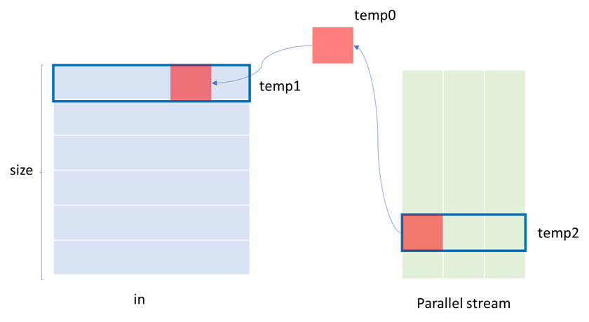
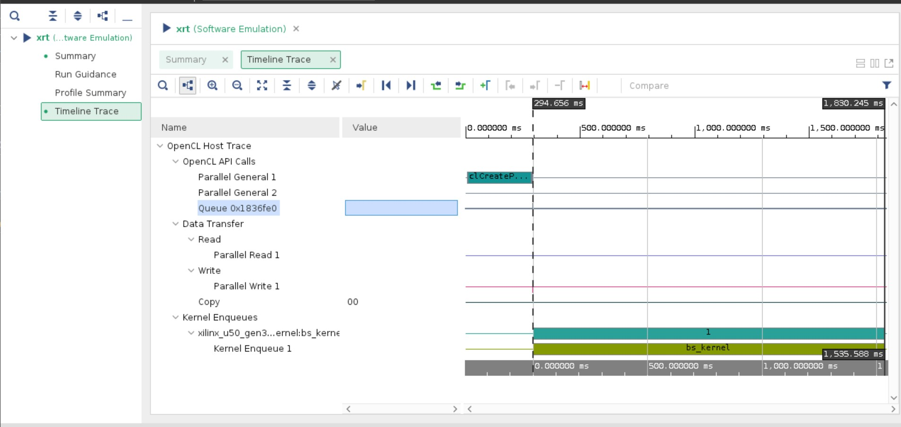
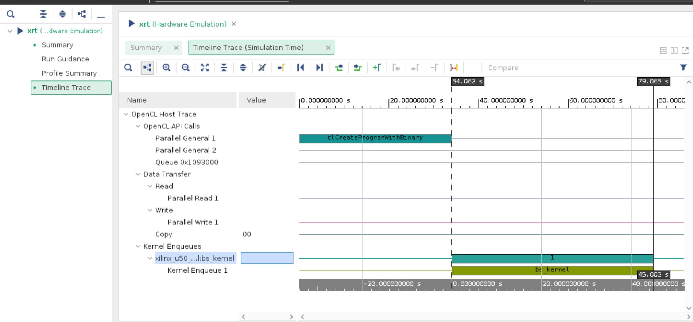
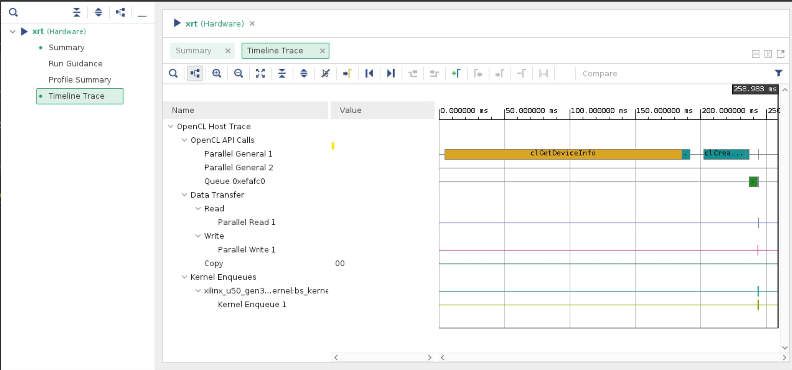
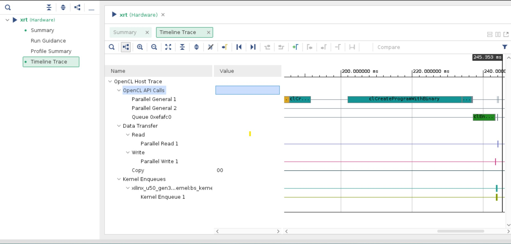
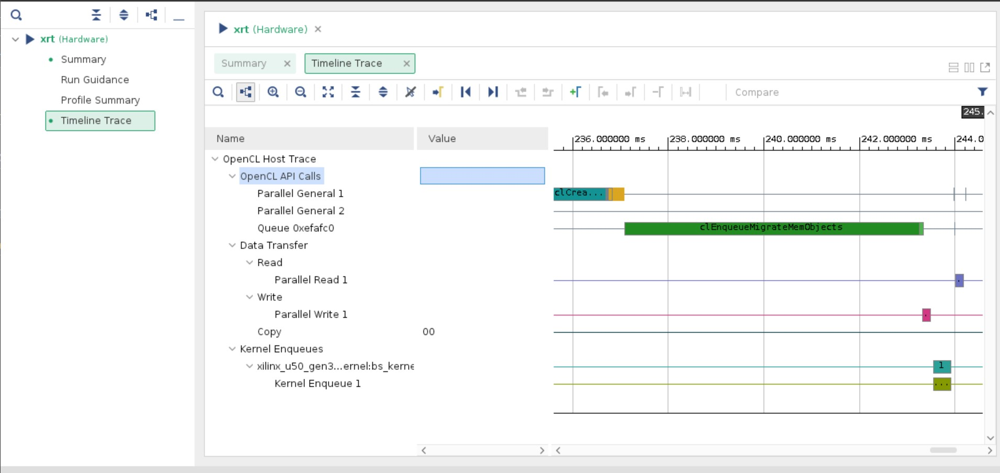
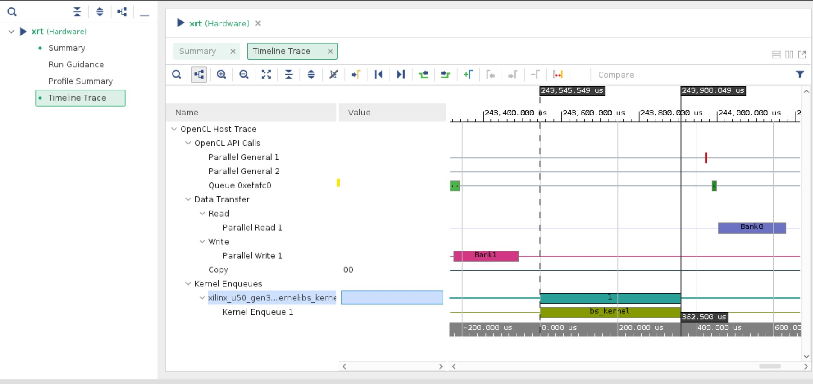
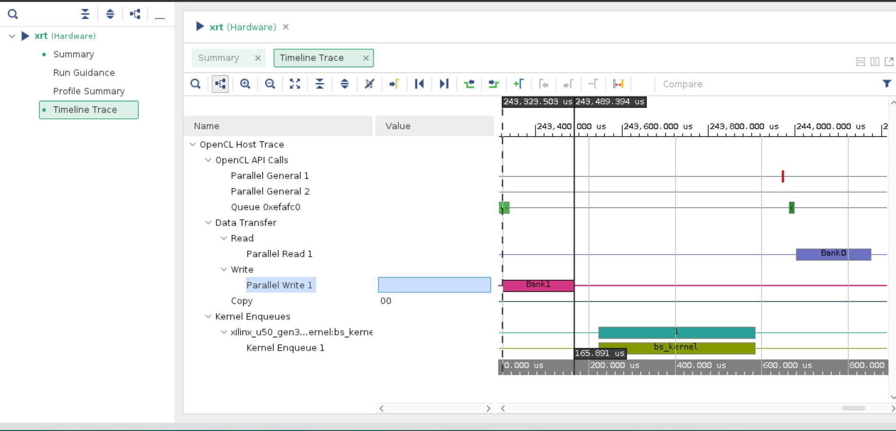
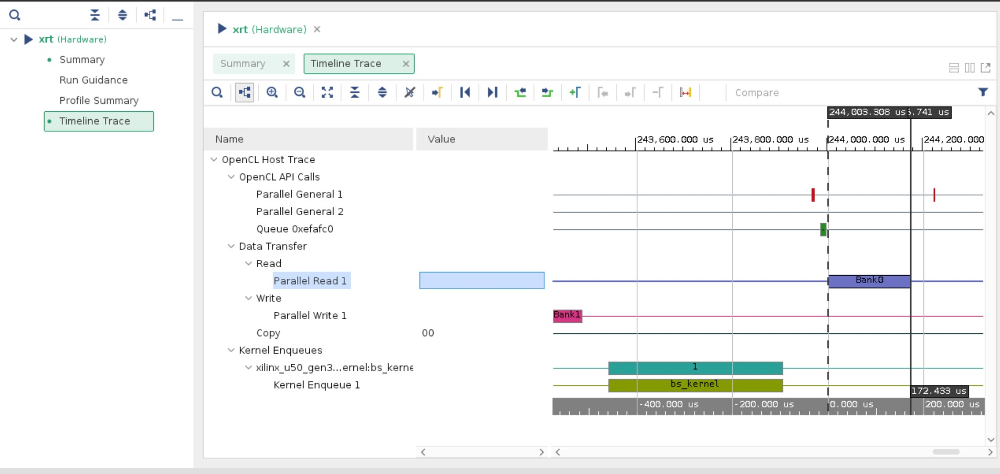
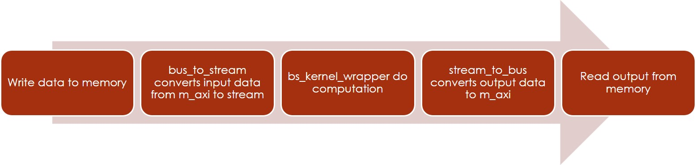

# Quantitative Finance

## Black Scholes Model

參考資料: <https://www.investopedia.com/terms/b/blackscholes.asp>

布萊克-休斯模型於1973年被提出，他是現今被認為是為期權合約定價的最佳模型，他需要五個輸入，分別是期權執行價格、當前股價、到期時間、無風險利率、和隱含波動率。但是他沒有考慮到可以在到期日前行駛的期權，也就是美式期權，所以只試用於在到期日前都不能行駛的歐式期權定價。

他有些前提：

1. 在期權有效期內不發派股息
2. 市場走勢無法預測
3. 購買期權沒有交易成本
4. 標的資產的無風險利率和波動率是已知且恆定的
5. 標的資產的回報呈對數正態分佈(因為資產不能是負值)
6. 期權是歐式的，只能在到期時行使

數學模型

$$
C = S_tN(d_1) - Ke^{-rt}N(d_2)\\
d_1 = \frac{ln\frac{S_t}{K}+(r+\frac{\sigma_v^2}{2})t}{\sigma_s \sqrt{t}}\\
d_2 = d_1 - \sigma_s\sqrt{t}\\

$$
C: Call option price

S: Current stock price

K: Strike price

r: Risk-free interest rate

t: Time to maturity

N: A normal distribution

隨著高頻交易的興起，而Black-Scholes model又是一個可靠的模型，所以縮短模型運算的所花時間成為了我們這組加速的主題。

## Code Structure

### Host

#### Pick the device

```Cpp
// Get a list of U250s available on the system (just because our current
// bitstreams are built for U250s)
deviceList = DeviceManager::getDeviceList(device);
// we'll just pick the first device in the...
pChosenDevice = deviceList[0];

```

#### Prepare test data

```Cpp
// Populate the asset data...
for (unsigned int i = 0; i < numAssets; i++) {
    cfBlackScholes.stockPrice[i] = 100.0f;
    cfBlackScholes.strikePrice[i] = 100.0f;
    cfBlackScholes.volatility[i] = 0.1f;
    cfBlackScholes.riskFreeRate[i] = 0.025f;
    cfBlackScholes.timeToMaturity[i] = 1.0f;
}

```

#### Run BS model

```Cpp
cfBlackScholes.run(OptionType::Put, numAssets);

```

#### print and check results

```Cpp
int ret = 0; // assume pass
for (unsigned int i = 0; i < numAssets; i++) {
    printf("[XLNX] | %5u | %8.5f | %8.5f | %8.5f | %8.5f | %8.5f | %8.5f |\n", i, cfBlackScholes.optionPrice[i],
            cfBlackScholes.delta[i], cfBlackScholes.gamma[i], cfBlackScholes.vega[i], cfBlackScholes.theta[i],
            cfBlackScholes.rho[i]);

    // quick fix to get pass/fail criteria
    if (!check(cfBlackScholes.optionPrice[i], 2.82636, tolerance)) {
        ret = 1;
    }
    if (!check(cfBlackScholes.delta[i], -0.38209, tolerance)) {
        ret = 1;
    }
    if (!check(cfBlackScholes.gamma[i], 0.03814, tolerance)) {
        ret = 1;
    }
    if (!check(cfBlackScholes.vega[i], 0.38139, tolerance)) {
        ret = 1;
    }
    if (!check(cfBlackScholes.theta[i], -0.00241, tolerance)) {
        ret = 1;
    }
    if (!check(cfBlackScholes.rho[i], 0.41035, tolerance)) {
        ret = 1;
    }
}

// show pass or fail
if (!ret) {
    printf("PASS\n");
} else {
    printf("FAIL\n");
}
```

### kernel

Kernel被分割成兩個部分：一個是專門處理data interface的部分，另一個是專門處理kernel運算的部分。

#### bs_kernel

bs_kernel分成三個步驟，來完成，一個是把m_axi得到的資料轉換成stream，第二步是做運算，最後是再把以stream的方式傳出來結果轉換成m_axi

##### m_axi to stream

```Cpp
// Convert the bus (here DDR BUS_WIDTH bits) into a number of parallel streams
// according to NUM_KERNELS
bus_to_stream<DT, DT_EQ_INT, WideDataType, WideStreamType, BUS_WIDTH, NUM_KERNELS>(s_in, s_stream, ddr_words);
bus_to_stream<DT, DT_EQ_INT, WideDataType, WideStreamType, BUS_WIDTH, NUM_KERNELS>(v_in, v_stream, ddr_words);
bus_to_stream<DT, DT_EQ_INT, WideDataType, WideStreamType, BUS_WIDTH, NUM_KERNELS>(r_in, r_stream, ddr_words);
bus_to_stream<DT, DT_EQ_INT, WideDataType, WideStreamType, BUS_WIDTH, NUM_KERNELS>(t_in, t_stream, ddr_words);
bus_to_stream<DT, DT_EQ_INT, WideDataType, WideStreamType, BUS_WIDTH, NUM_KERNELS>(k_in, k_stream, ddr_words);
```

##### compute

```Cpp
// This wrapper takes in the parallel streams and processes them using
// NUM_KERNELS separate kernels
bs_stream_wrapper(s_stream, v_stream, r_stream, t_stream, k_stream, call, num, price_stream, delta_stream, gamma_stream, vega_stream, theta_stream, rho_stream);
```

```Cpp
void bs_stream_wrapper(WideStreamType& s_stream,
                       WideStreamType& v_stream,
                       WideStreamType& r_stream,
                       WideStreamType& t_stream,
                       WideStreamType& k_stream,
                       unsigned int call,
                       unsigned int size,
                       WideStreamType& price_stream,
                       WideStreamType& delta_stream,
                       WideStreamType& gamma_stream,
                       WideStreamType& vega_stream,
                       WideStreamType& theta_stream,
                       WideStreamType& rho_stream) {
    for (unsigned int i = 0; i < size; i += NUM_KERNELS) {
        WideDataType s, v, r, t, k, price, delta, gamma, vega, theta, rho;

#pragma HLS PIPELINE II = 1

        // This will read NUM_KERNEL's worth of streams
        s = s_stream.read();
        v = v_stream.read();
        r = r_stream.read();
        t = t_stream.read();
        k = k_stream.read();

    parallel_bs:
        for (unsigned int j = 0; j < NUM_KERNELS; ++j) {
#pragma HLS UNROLL
            // Use BSM engine with q fixed to 0 as original BS model
            xf::fintech::cfBSMEngine<DT>(s.data[j], v.data[j], r.data[j], t.data[j], k.data[j], 0, call,
                                         &(price.data[j]), &(delta.data[j]), &(gamma.data[j]), &(vega.data[j]),
                                         &(theta.data[j]), &(rho.data[j]));
        }

        price_stream.write(price);
        delta_stream.write(delta);
        gamma_stream.write(gamma);
        vega_stream.write(vega);
        theta_stream.write(theta);
        rho_stream.write(rho);
    }
}
```

實際上kernel的運算被包在L2中，L2的運算可以被分成幾個部分，一個是先算出模型運算中會用到的一些值，另一個則是根據到底現在是call還是pull來決定運算方式，最後就是根據演算法的需求再進行後運算，最後輸出最終結果

###### 計算演算法運算途中會用到的值

```cpp
// Intermediate elements for calculating price and Greeks
DT sqrt_t = hls::sqrtf(t);
DT sqrt_t_recip = 1.0f / sqrt_t;
DT d1 = (hls::logf(s / k) + (r - q + 0.5f * v * v) * t) / (v * sqrt_t);
DT d2 = d1 - v * sqrt_t;
DT exp_d1n_sq_div2 = hls::expf(-0.5f * d1 * d1);
DT pdf_d1 = SQRT_2PI_RECIP * exp_d1n_sq_div2;
DT phi_d1 = internal::phi<DT>(d1);
DT phi_d2 = internal::phi<DT>(d2);
DT phi_d1n = 1.0 - phi_d1; // phi(-d1);
DT phi_d2n = 1.0 - phi_d2; // phi(-d2);
DT exp_qt = hls::expf(-q * t);
DT exp_rt = hls::expf(-r * t);
DT k_exp_rt = k * exp_rt;
DT r_k_exp_rt = r * k_exp_rt;
DT t_k_exp_rt = t * k_exp_rt;
DT theta_x = -0.5f * sqrt_t_recip * v * s * exp_qt * pdf_d1;
```

###### 根據call/ pull進行不同的運算

```cpp
// Local working variables as some elements can be reused
DT price_temp;
DT delta_temp;
DT theta_temp;
DT rho_temp;
DT gamma_temp;
DT vega_temp;

// Calculate price and [some] Greeks for call/put
if (call) {
    delta_temp = exp_qt * phi_d1;
    DT s_delta_temp = s * delta_temp;
    DT k_exp_re_phi_d2 = k_exp_rt * phi_d2;
    price_temp = s_delta_temp - k_exp_re_phi_d2;
    theta_temp = ANNUALIZED_SCALE * (theta_x + q * s_delta_temp - r * k_exp_re_phi_d2);
    rho_temp = PERCENTAGE_SCALE * t * k_exp_re_phi_d2;
} else {
    delta_temp = -exp_qt * phi_d1n;
    DT s_delta_temp = s * delta_temp;
    DT k_exp_re_phi_d2n = k_exp_rt * phi_d2n;
    price_temp = s_delta_temp + k_exp_re_phi_d2n;
    theta_temp = ANNUALIZED_SCALE * (theta_x + q * s_delta_temp + r * k_exp_re_phi_d2n);
    rho_temp = PERCENTAGE_SCALE * t * k_exp_re_phi_d2n;
}
```

###### 後處理

```cpp
// Remaining Greeks are put/call independent
gamma_temp = exp_qt * exp_d1n_sq_div2 / (s * v * sqrt_t * SQRT_2PI);
vega_temp = PERCENTAGE_SCALE * s * exp_qt * sqrt_t * pdf_d1;
```

###### 輸出

```cpp
// Return the price/Greeks
*price = price_temp;
*delta = delta_temp;
*theta = theta_temp;
*rho = rho_temp;
*gamma = gamma_temp;
*vega = vega_temp;
```

##### stream to m_axi

```Cpp
// Convert the NUM_KERNELS streams back to the wide data bus
stream_to_bus<DT, DT_EQ_INT, WideDataType, WideStreamType, BUS_WIDTH, NUM_KERNELS>(price_stream, price_out, ddr_words);
stream_to_bus<DT, DT_EQ_INT, WideDataType, WideStreamType, BUS_WIDTH, NUM_KERNELS>(delta_stream, delta_out, ddr_words);
stream_to_bus<DT, DT_EQ_INT, WideDataType, WideStreamType, BUS_WIDTH, NUM_KERNELS>(gamma_stream, gamma_out, ddr_words);
stream_to_bus<DT, DT_EQ_INT, WideDataType, WideStreamType, BUS_WIDTH, NUM_KERNELS>(vega_stream, vega_out, ddr_words);
stream_to_bus<DT, DT_EQ_INT, WideDataType, WideStreamType, BUS_WIDTH, NUM_KERNELS>(theta_stream, theta_out, ddr_words);
stream_to_bus<DT, DT_EQ_INT, WideDataType, WideStreamType, BUS_WIDTH, NUM_KERNELS>(rho_stream, rho_out, ddr_words);
```

##### pragma

下面的code是kernel的interface

```Cpp
void bs_kernel(ap_uint<BUS_WIDTH>* s_in,
               ap_uint<BUS_WIDTH>* v_in,
               ap_uint<BUS_WIDTH>* r_in,
               ap_uint<BUS_WIDTH>* t_in,
               ap_uint<BUS_WIDTH>* k_in,
               unsigned int call,
               unsigned int num,
               ap_uint<BUS_WIDTH>* price_out,
               ap_uint<BUS_WIDTH>* delta_out,
               ap_uint<BUS_WIDTH>* gamma_out,
               ap_uint<BUS_WIDTH>* vega_out,
               ap_uint<BUS_WIDTH>* theta_out,
               ap_uint<BUS_WIDTH>* rho_out)
```

下面的code是kernel interface的pragma

```Cpp
/// @brief Define the AXI parameters.  Each input/output parameter has a
/// separate port
#pragma HLS INTERFACE m_axi port = s_in offset = slave bundle = in0_port
#pragma HLS INTERFACE m_axi port = v_in offset = slave bundle = in1_port
#pragma HLS INTERFACE m_axi port = r_in offset = slave bundle = in2_port
#pragma HLS INTERFACE m_axi port = t_in offset = slave bundle = in3_port
#pragma HLS INTERFACE m_axi port = k_in offset = slave bundle = in4_port
#pragma HLS INTERFACE m_axi port = price_out offset = slave bundle = out0_port
#pragma HLS INTERFACE m_axi port = delta_out offset = slave bundle = out1_port
#pragma HLS INTERFACE m_axi port = gamma_out offset = slave bundle = out2_port
#pragma HLS INTERFACE m_axi port = vega_out offset = slave bundle = out3_port
#pragma HLS INTERFACE m_axi port = theta_out offset = slave bundle = out4_port
#pragma HLS INTERFACE m_axi port = rho_out offset = slave bundle = out5_port

#pragma HLS INTERFACE s_axilite port = s_in bundle = control
#pragma HLS INTERFACE s_axilite port = v_in bundle = control
#pragma HLS INTERFACE s_axilite port = r_in bundle = control
#pragma HLS INTERFACE s_axilite port = t_in bundle = control
#pragma HLS INTERFACE s_axilite port = k_in bundle = control
#pragma HLS INTERFACE s_axilite port = price_out bundle = control
#pragma HLS INTERFACE s_axilite port = delta_out bundle = control
#pragma HLS INTERFACE s_axilite port = gamma_out bundle = control
#pragma HLS INTERFACE s_axilite port = vega_out bundle = control
#pragma HLS INTERFACE s_axilite port = theta_out bundle = control
#pragma HLS INTERFACE s_axilite port = rho_out bundle = control

#pragma HLS INTERFACE s_axilite port = call bundle = control
#pragma HLS INTERFACE s_axilite port = num bundle = control
#pragma HLS INTERFACE s_axilite port = return bundle = control
```

下面的code是關於bus轉stream或是stream轉bus的stream的宣告

```Cpp
    WideStreamType s_stream("s_stream");
    WideStreamType v_stream("v_stream");
    WideStreamType r_stream("r_stream");
    WideStreamType t_stream("t_stream");
    WideStreamType k_stream("k_stream");

    WideStreamType price_stream("price_stream");
    WideStreamType delta_stream("delta_stream");
    WideStreamType gamma_stream("gamma_stream");
    WideStreamType vega_stream("vega_stream");
    WideStreamType theta_stream("theta_stream");
    WideStreamType rho_stream("row_stream");

#pragma HLS STREAM variable = s_stream depth = 32
#pragma HLS STREAM variable = v_stream depth = 32
#pragma HLS STREAM variable = r_stream depth = 32
#pragma HLS STREAM variable = t_stream depth = 32
#pragma HLS STREAM variable = k_stream depth = 32
#pragma HLS STREAM variable = price_stream depth = 32
#pragma HLS STREAM variable = delta_stream depth = 32
#pragma HLS STREAM variable = gamma_stream depth = 32
#pragma HLS STREAM variable = vega_stream depth = 32
#pragma HLS STREAM variable = theta_stream depth = 32
#pragma HLS STREAM variable = rho_stream depth = 32
```

#### bus_interface

DT               :Data type (float/double) of the parameter packed into the vector bus

DT_INT_EQUIVALENT:Equivalently sized integer type of DT

WDT              :Wide Data Type - the container for the parallel parameters

WST              :Wide Stream Type - the stream container of the WDT

BUS_WIDTH        :Size of bus in bits (eg for DDR -> 512)

NUM_STREAMS      :Number of parallel streams to construct (matches size of the WDT,
                  WST)

out_stream       :Stream representation of data to be written to bus

in_stream        :Stream representation of this input data

out              :Pointer to an address to write the vector data (must be correctly
                  aligned)

in               :Pointer to an address containing the vector

size             :Number of vector writes to make

##### bus_to_stream


上圖是用來解釋下方的code，第一層的for loop把每次都從bus取出一個bus寬度的資料，以DDR memory為例，就是取出512bits。在第二層的for loop中，他先從bus寬度的資料切出一個DT長度的資料，可能是32bits的int或是64bits的float，之後寫進一個stream，由於他的stream是parallel stream的方式，所以他是寫進多條stream中的其中一條，而這個parallel stream的寬度則是WDT，可能是數個DT的寬度。

```Cpp
    for (unsigned int i = 0; i < size; ++i) {
#pragma HLS PIPELINE II = 1

        ap_uint<BUS_WIDTH> temp0 = in[i];
        DT_INT_EQUIVALENT temp1 = 0;
        WDT temp2;

    mem_rd_vector:
        for (unsigned int j = 0; j < vector_words; j += NUM_STREAMS) {
#pragma HLS ARRAY_PARTITION variable = temp2 complete
        mem_rd_per_stream:
            for (unsigned int k = 0; k < NUM_STREAMS; k++) {
#pragma HLS UNROLL
                temp1 = temp0.range(bits_per_data_type * (j + k + 1) - 1, bits_per_data_type * (j + k));
                temp2.data[k] = *(DT*)(&temp1);
            }
            in_stream.write(temp2);
        }
    }
```

##### stream_to_bus



上圖是下面的code的示意圖，這次則是把stream再寫回bus，跟上述的code差不多，他從parallel stream中取出數個DT長度的資料，也就是WDT寬度的資料，在第三層的for loop進行切割，切割成一個DT的長度並擺進具有bus寬度的temp1中，以DDR為例，temp1的長度為512bits，最後再把temp1寫進記憶體。

```Cpp
    for (unsigned int i = 0; i < size; ++i) {
#pragma HLS PIPELINE II = 1

        DT temp0 = 0.0f;
        ap_uint<BUS_WIDTH> temp1 = 0;
        WDT temp2;

    mem_wr_vector:
        for (unsigned int j = 0; j < vector_words; j += NUM_STREAMS) {
#pragma HLS ARRAY_PARTITION variable = temp2 complete
            temp2 = out_stream.read();
        mem_wr_per_kernel:
            for (unsigned int k = 0; k < NUM_STREAMS; k++) {
#pragma HLS UNROLL
                temp0 = temp2.data[k];
                temp1.range(bits_per_data_type * (j + k + 1) - 1, bits_per_data_type * (j + k)) =
                    *(DT_INT_EQUIVALENT*)(&temp0);
            }
        }
        out[i] = temp1;
    }
```

## Check Report

在整個lab的過程中，我們使用的是makefile中提供的指令來進行，但是我們需要產生run_summary來看波形圖，所以在makefile中又加入

```tcl
opencl_summary=true
opencl_trace=true
```

並且執行`V++`的時候，需轉換成`V++ -g`

執行的方式如下:

```console
> make run TARGET=sw_emu DEVICE=xilinx_u50_gen3x16_xdma_201920_3
> make run TARGET=hw_emu DEVICE=xilinx_u50_gen3x16_xdma_201920_3
> make run TARGET=hw DEVICE=xilinx_u50_gen3x16_xdma_201920_3
```

## Performance Analysis

我們跑了Software emulation、hardware emulation、和hardware，我們在下面分別把他們的timeline的截圖給列出來：

### Software Emulation



從這張圖可以看到我們的時間大部分都花在執行我們的BS的演算法上，整個BS演算法大概花了1.54秒來完成。

### Hardware Emulation


從這張圖來看，我們可以看到我們的時間大部分都還是花在執行BS的演算法，整個過程大概花了45秒來完成。在這個步驟中，kernel會被編譯成RTL behavior model並進行模擬，因為比software的部分又多考慮了硬體的行為，所以比software emulation所需要的時間還多。

### Hardware



上面這張圖是整個Host program執行的timeline，從這張圖來看，我們可以看到我們花最多時間的部分是尋找可用的device，於是我們放大後面的部份。


上面這張圖是Host program在執行的時候花第二多時間的地方，也就是把binary file載入我們的U50。


上面這張圖是Host program在執行的時候花第三多時間的地方，也就是做記憶體配置的部分。


上面這張圖是真正U50執行BS演算法所花的時間，從圖中可以看到我們U50執行實際上所花的時間為362 $\mu s$。


從上面這張圖來看，我們花在write data上的時間是166 $\mu s$



從上面這張圖來看，我們花在read data上的時間是172 $\mu s$

由於我們host的做法是一次準備好十筆測試的資料，並存進memory中，之後經由kernel的bus_to_stream把測試資料從memory中取出並轉換成stream的形式給bs_kernel做運算，在bs_kernel完成計算之後，在藉由stream_to_bus把算好的值存回memory，並給host取出結果。之後再一次驗證所有的資料，所以在執行kernel的期間，並沒有做memory access。

這個library提供了一個可以有效運用memory bandwidth的方法，當從memory取值出來做運算時，藉由bus_to_stream的轉換，把資料轉換成我們要的長度，之後再用stream_to_bus的方式把輸出的資料可以盡量填滿memory bandwidth的方式，盡量縮短傳遞資料所需要的時間。

## Suggestion for improvement

目前的kernel的架構為:



但是我們可以把I/O的data改成stream的形式，就可以越過Host把Input存進memory內，經過bus_to_stream，之後output data再經過stream_to_bus之後再給Host從memory讀出output等等的步驟。改良之後的implementation長成:


如果改良成這樣的話，我們可以減少利用m_axi傳遞資料所需要的時間，也可以把bus_to_stream和stream_to_bus給化簡掉。